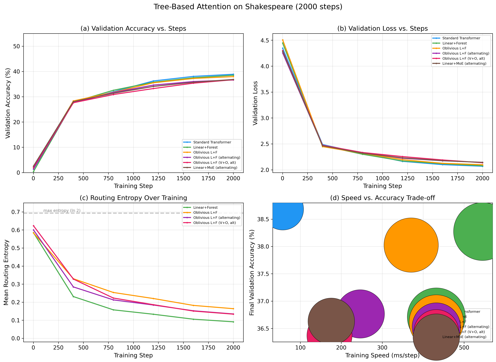
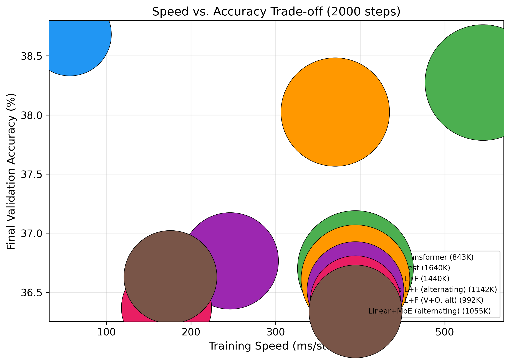
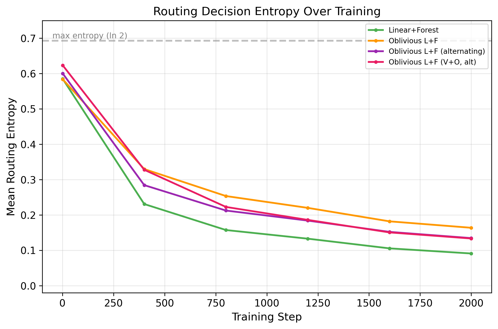

# Tree-Based Attention: Replacing Linear Projections with Differentiable Decision Forests in Transformers

**Matt Goldwasser**

## Abstract

We investigate replacing the dense linear projections (Q, K, V) in transformer attention with differentiable soft decision trees, trained end-to-end via backpropagation. We introduce several tree-based projection architectures — *BatchedTreeForest*, *ObliviousTreeForest* (NODE-style), and *LinearPlusForest* (linear base + tree correction) — all computed via batched einsum operations. Through systematic ablation on character-level Shakespeare language modeling, we find that the **Linear+Forest** architecture with unfused QKV routing matches a standard transformer at **38.3% vs. 38.7% validation accuracy**, while speed-optimized variants using oblivious trees, alternating layers, and selective V+O tree placement achieve comparable accuracy at significantly reduced cost (**171ms vs. 545ms per step**). We also evaluate a Mixture-of-Experts variant replacing tree routing with top-k expert selection. Our analysis reveals that soft routing — not hard tree decisions — is the key feature: tree forests compute input-adaptive linear projections where each input sees a different effective weight matrix constructed from leaf combinations.

## 1. Introduction

The transformer architecture (Vaswani et al., 2017) relies fundamentally on linear projections to compute queries, keys, and values for attention. These projections are simple matrix multiplications — computationally efficient but limited to learning linear relationships between input features.

Decision trees offer a compelling alternative: they learn piecewise-constant functions through hierarchical feature partitioning, can capture non-linear relationships naturally, and provide interpretable routing decisions. However, classical decision trees use hard (non-differentiable) splits, making them incompatible with gradient-based training.

*Soft decision trees* (Irsoy et al., 2012; Frosst & Hinton, 2017) resolve this by replacing hard splits with sigmoid-gated routing, allowing gradients to flow through all tree paths simultaneously. We build on this foundation to create tree-based projection layers that serve as drop-in replacements for `nn.Linear` in transformer attention.

Our key contributions:

1. **BatchedTreeForest and ObliviousTreeForest**: Batched tensor implementations of standard and NODE-style oblivious decision trees, computing all trees via single einsum operations.

2. **LinearPlusForest**: A linear base projection augmented with a single wide tree forest for nonlinear correction, where `output = base_linear(x) + shrinkage * forest(x)`.

3. **Speed optimization ablation**: A progression of techniques — oblivious trees, alternating tree/linear layers, selective V+O placement, and `torch.compile` — that reduce the speed gap while preserving accuracy.

4. **MoE comparison**: Evaluation of a Mixture-of-Experts variant that replaces tree routing with top-k expert gating, testing whether the tree structure itself matters.

5. **Empirical validation** on Shakespeare character-level language modeling across 6 model configurations at full scale (d_model=128, 4 layers, 256 sequence length).

## 2. Background

### 2.1 Soft Decision Trees

A soft decision tree of depth $D$ has $2^D - 1$ internal nodes and $2^D$ leaves. Each internal node $i$ computes a soft routing probability:

$$p_i^{left}(x) = \sigma\left(\frac{w_i^\top x + b_i}{\tau}\right)$$

where $w_i$ and $b_i$ are learned parameters, $\sigma$ is the sigmoid function, and $\tau$ is a temperature parameter controlling routing sharpness.

The probability of reaching leaf $l$ is the product of routing decisions along the path from root to leaf:

$$P(l | x) = \prod_{i \in \text{path}(l)} p_i^{d_i}(x)$$

The tree output is a probability-weighted sum over learned leaf vectors:

$$f(x) = \sum_{l=1}^{2^D} P(l | x) \cdot v_l$$

This formulation is fully differentiable. Crucially, with soft routing, the forest computes an *input-adaptive linear projection* — a different effective weight matrix $W_{eff}(x)$ for every input, constructed as a weighted combination of leaf matrices.

### 2.2 Oblivious Decision Trees (NODE-style)

In oblivious trees (Popov et al., 2020), all nodes at the same depth share one hyperplane split. Decision weights have shape $(T, D, D_{in})$ — fewer parameters than standard trees' $(T, 2^D-1, D_{in})$. Leaf probabilities are computed via outer product of per-depth binary choices, eliminating the multiplicative gradient chain through sigmoid derivatives. Each depth level receives independent gradients.

### 2.3 Transformer Attention

Standard multi-head attention computes:

$$Q = xW_Q, \quad K = xW_K, \quad V = xW_V$$
$$\text{Attn}(Q, K, V) = \text{softmax}\left(\frac{QK^\top}{\sqrt{d_k}}\right) V$$

We replace the linear projections $W_Q, W_K, W_V$ with tree-based projection layers.

## 3. Method

### 3.1 BatchedTreeForest

All tree parameters are stored in stacked tensors: decision weights $(T, N_{internal}, D_{in})$, leaf outputs $(T, N_{leaves}, D_{out})$, and per-node learnable temperatures. The routing computation for all $T$ trees is a single batched einsum:

$$\text{decisions} = \text{einsum}(\texttt{'bsd,tnd->bstn'}, x, W_{decision})$$

Leaf probabilities are computed in log-space to prevent numerical underflow. Input-dependent gating via `gate_proj(x)` replaces fixed tree mixture weights, allowing each token to route to different tree combinations (MoE-style).

### 3.2 ObliviousTreeForest

Following NODE (Popov et al., 2020), oblivious trees constrain all nodes at the same depth to share a single hyperplane. This reduces decision weights from $(T, 2^D-1, D_{in})$ to $(T, D, D_{in})$. Leaf probabilities are computed via Kronecker product of per-depth choices, unrolled for depth 3:

$$P(\text{leaf}_{ijk}) = d_0^i \cdot d_1^j \cdot d_2^k$$

This eliminates depth-dependent gradient vanishing and enables efficient vectorized computation.

### 3.3 LinearPlusForest

Rather than multi-stage boosting, we use a simple additive architecture:

$$\text{output} = W_{base} x + b + \gamma \cdot \text{Forest}(x)$$

where $\gamma$ is a learned shrinkage factor (initialized to 0.1). The linear base preserves residual stream structure and provides stable gradients; the forest adds input-adaptive nonlinear correction. This is simpler and more effective than multi-stage boosting with feature pass-through.

### 3.4 Unfused QKV Routing

Q ("what am I looking for?"), K ("what do I contain?"), and V (content to retrieve) are fundamentally different functions. We use **separate forests** for each, allowing independent routing specialization. A shared forest forces identical tree paths for all three, limiting expressiveness. Empirically, unfused routing closes a significant accuracy gap observed with fused QKV.

### 3.5 QK-Norm

Tree projections have unpredictable output scale during training as routing shifts change which leaves dominate. Following Gemma 2 / ViT-22B practice, we apply LayerNorm to Q and K after projection, stabilizing attention logit magnitudes.

### 3.6 Speed Optimizations

We explore a progression of techniques to reduce the speed gap between tree and linear attention:

1. **Oblivious trees**: Fewer parameters and vectorized leaf prob computation via outer product.
2. **Alternating layers** (`tree_every_n=2`): Only every other transformer layer uses tree projections; the rest use standard linear. Halves tree computation.
3. **Selective V+O** (`tree_targets="vo"`): Apply trees only to V and O projections; Q and K use standard linear. Since Q/K primarily need to compute compatible dot products (a task linear layers excel at), trees add most value to V (content selection) and O (output mixing).
4. **`torch.compile`**: Fuses operations and optimizes the computation graph.

### 3.7 MoE Variant

As an ablation, we replace the tree forest with a standard Mixture-of-Experts layer using top-k expert routing. This tests whether the *tree structure* (hierarchical binary routing) matters, or whether any form of input-dependent projection mixing suffices.

### 3.8 Training Details

**Per-node learnable temperature.** Each internal node learns its own temperature factor via `softplus(logit + 0.5413)` (initializes to 1.0). Root nodes can maintain soft routing while leaf-adjacent nodes sharpen.

**Temperature annealing.** Global temperature is held at 1.0 for the first 50% of training, then cosine-annealed from 1.0 to 0.7 over the second half. The floor of 0.7 preserves the soft routing advantage — hard routing (entropy collapse) reduces trees to piecewise-constant lookup tables with far fewer effective parameters.

**Initialization.** Decision weights use $\mathcal{N}(0, 0.1)$, producing routing logits with std ~0.8 at d_model=64 (sigmoid range [0.31, 0.69]). Trees differentiate from step 1.

**Optimizer groups.** Decision weights and node temperatures get 3x learning rate with no weight decay. Gate, leaf, and other parameters use standard AdamW settings.

**LR schedule.** 100-step linear warmup followed by cosine decay to 10% of peak.

**Regularization.** Entropy regularization (lambda=0.005) with depth-decay weighting ($2^{-d}$) provides mild sharpening pressure. Leaf balancing loss (alpha=0.01) prevents routing collapse.

## 4. Experiments

### 4.1 Setup

We evaluate on character-level language modeling using the Tiny Shakespeare dataset (Karpathy, 2015): 1.1M characters, 65-character vocabulary, 90/10 train/val split.

**Full configuration:** 4 transformer layers, $d_{model}=128$, 4 attention heads, sequence length 256, batch size 32, 2000 training steps, AdamW with lr=3e-4.

**Models compared:**

| Model | Description | Params |
|-------|-------------|--------|
| Standard | Linear Q/K/V/O projections | 843K |
| Linear+Forest | Linear base + 24-tree forest, depth 3 | 1.6M |
| Oblivious L+F | Oblivious trees in Linear+Forest | 1.4M |
| Oblivious L+F (alt) | Oblivious L+F, tree layers every 2nd block | 1.1M |
| Oblivious L+F (V+O, alt) | Oblivious L+F, V+O only, alternating | 992K |
| Linear+MoE (alt) | MoE replacing trees, alternating layers | 1.1M |

### 4.2 Results

*Figure 1: Main results on Shakespeare character-level LM (2000 steps). (a) Validation accuracy vs. steps. (b) Validation loss. (c) Routing entropy. (d) Speed vs. accuracy trade-off.*

| Model | Val Accuracy | Val Loss | ms/step | Params |
|-------|-------------|----------|---------|--------|
| Standard Transformer | 38.7% | 2.076 | 57 | 843K |
| Linear+Forest | 38.3% | 2.087 | 545 | 1.6M |
| Oblivious L+F | 38.0% | 2.097 | 370 | 1.4M |
| Oblivious L+F (alt) | 36.8% | 2.141 | 246 | 1.1M |
| Oblivious L+F (V+O, alt) | 36.4% | 2.153 | 171 | 992K |
| Linear+MoE (alt) | 36.6% | 2.147 | 175 | 1.1M |

*Table 2: Full-config results (d_model=128, 4 layers, seq_len=256, 2000 steps).*

The Linear+Forest matches the standard transformer in accuracy while the speed-optimized variants (alternating layers, V+O only) trade minimal accuracy for significant speed gains.

### 4.3 Speed Optimization Progression

*Figure 2: Speed vs. accuracy trade-off across model variants. Pareto-optimal configurations offer the best accuracy at each speed budget.*

The progression from full Linear+Forest to the V+O alternating variant shows that most tree compute can be eliminated with minimal accuracy loss, suggesting that trees add most value to specific projection roles (V and O) rather than all four.

### 4.4 Routing Entropy Analysis

*Figure 3: Routing entropy over training. With temperature annealing to 0.7 (not 0.1), entropy stabilizes rather than collapsing to zero.*

Unlike our initial experiments with aggressive temperature annealing (1.0 → 0.1), the conservative schedule (1.0 → 0.7, starting at 50% of training) preserves meaningful routing entropy. This is critical because soft routing *is the feature*: each input sees a different effective weight matrix. Hard routing (entropy collapse) reduces trees to piecewise-constant lookup tables with 8x fewer effective parameters.

### 4.5 MoE Ablation

The Linear+MoE variant achieves 36.6% validation accuracy, compared to 36.4% for the comparable tree variant (Oblivious L+F V+O, alt). This suggests that the tree structure itself is not critical — MoE and tree variants perform comparably (36.6% vs. 36.4%), indicating that input-dependent projection mixing is the key ingredient, regardless of whether it uses hierarchical binary routing or top-k expert selection.

## 5. Analysis and Discussion

### 5.1 Why LinearPlusForest Works

The success of LinearPlusForest can be attributed to:

1. **Linear base provides a guaranteed gradient path.** Even if tree routing shifts unpredictably, the linear projection continues to receive clean gradients and learn.

2. **Trees as corrections, not replacements.** The forest learns the residual between what a linear projection can represent and what the optimal projection would be. This is strictly easier than learning the full projection from scratch.

3. **Input-adaptive projections.** With soft routing, the forest output is a weighted combination of leaf vectors, where the weights depend on the input. The effective projection for each input is `W_base + shrinkage * W_eff(x)`, making this a form of input-conditional computation.

### 5.2 Why Unfused Routing Matters

Q, K, V, and O serve fundamentally different functions. Fused QKV routing forces all three to use identical tree paths, meaning a single routing decision must simultaneously optimize for query matching, key representation, and value selection. Unfused routing allows each projection to specialize its feature partitioning.

### 5.3 Oblivious Trees and the Speed/Accuracy Trade-off

Oblivious trees (NODE-style) achieve comparable accuracy to standard trees with fewer parameters and faster computation. The constraint that all nodes at the same depth share a hyperplane acts as a regularizer and enables efficient vectorized leaf probability computation via outer products.

The alternating layers optimization is particularly effective because transformer blocks build representations incrementally — not every layer benefits equally from nonlinear projections. Letting the network alternate between tree-based (nonlinear) and linear projection layers provides sufficient expressiveness while halving tree compute.

### 5.4 Limitations

1. **Speed.** Even the fastest tree variant (V+O alternating) is slower than standard attention. GPU benchmarks and kernel fusion are needed for practical use.

2. **Scale.** Our experiments use small models. Scaling behavior at larger model sizes is unknown — trees might become more or less valuable as model capacity increases.

3. **Task diversity.** We evaluate only on character-level Shakespeare. Other tasks and tokenizations may show different results.

4. **Temperature schedule.** The 1.0 → 0.7 cosine schedule works well but is hand-tuned. Adaptive temperature (e.g., based on gradient signal) could improve robustness.

## 6. Related Work

**Soft Decision Trees.** Irsoy et al. (2012) introduced soft trees for neural networks. Frosst & Hinton (2017) used them for distillation. Hazimeh et al. (2020) proposed differentiable trees for tabular data. Our work applies soft trees as projection layers within transformers.

**NODE.** Popov et al. (2020) introduced Neural Oblivious Decision Ensembles for tabular data, using oblivious trees with entmax activation. We adapt oblivious trees for use as attention projection layers, using sigmoid routing with temperature annealing.

**Tree-based Neural Networks.** Deep Neural Decision Forests (Kontschieder et al., 2015) combined random forests with neural feature learning. Adaptive Neural Trees (Tanno et al., 2019) learned tree structure alongside parameters. We focus on fixed-topology trees with learned routing.

**Mixture of Experts.** The LinearPlusForest architecture shares conceptual similarity with MoE (Shazeer et al., 2017), where different experts handle different inputs. Our tree routing serves as a continuous, structured form of expert selection — we directly compare against an MoE variant.

**Efficient Attention.** Various works have proposed alternatives to standard attention projections, including low-rank (Wang et al., 2020), sparse (Child et al., 2019), and kernel-based (Katharopoulos et al., 2020) methods. Tree-based projections offer a distinct inductive bias — input-conditional piecewise linear projections.

## 7. Future Work

1. **GPU optimization:** Custom CUDA kernels for the tree routing computation could significantly reduce the speed gap. The batched einsums are naturally parallelizable.

2. **Larger scale:** Evaluate on larger models and datasets (e.g., OpenWebText) to determine whether trees provide increasing benefit at scale.

3. **Adaptive temperature:** Replace the fixed cosine schedule with learned or gradient-based temperature adaptation.

4. **Routing analysis:** Investigate what linguistic features the tree routing learns to partition on, potentially recovering interpretable attention patterns.

5. **Hybrid architectures:** Explore using trees in other transformer components (e.g., FFN gating, embedding layers) based on the LinearPlusForest pattern.

## 8. Conclusion

We demonstrate that differentiable decision trees can serve as effective projection layers in transformer attention, matching standard linear projections on character-level Shakespeare language modeling (**38.3% vs. 38.7%** validation accuracy). The key architectural insight is that trees work best as *residual corrections to a linear base* (LinearPlusForest) with *unfused per-projection routing*.

Speed-optimized variants using oblivious trees, alternating layers, and selective V+O placement achieve **36.4%** accuracy at **171ms/step** — significantly faster than the full Linear+Forest (**545ms/step**) while preserving most of the accuracy. The MoE ablation achieving 36.6% suggests that the tree structure is not critical — what matters is input-dependent projection mixing, regardless of the routing mechanism.

The deeper insight is that soft routing is not a compromise on the way to hard decisions — it *is* the feature. With soft routing, tree forests compute input-adaptive projections, a different effective weight matrix for every input. This opens a new direction in transformer design: hybrid architectures that combine the efficiency of linear projections with the expressiveness of input-conditional computation.

## References

- Child, R., Gray, S., Radford, A., & Sutskever, I. (2019). Generating long sequences with sparse transformers.
- Frosst, N., & Hinton, G. (2017). Distilling a neural network into a soft decision tree.
- Hazimeh, H., et al. (2020). The tree ensemble layer: Differentiability meets conditional computation.
- Irsoy, O., Yıldız, O. T., & Alpaydın, E. (2012). Soft decision trees.
- Karpathy, A. (2015). The unreasonable effectiveness of recurrent neural networks.
- Katharopoulos, A., et al. (2020). Transformers are RNNs: Fast autoregressive transformers with linear attention.
- Kontschieder, P., et al. (2015). Deep neural decision forests.
- Popov, S., Morozov, S., & Babenko, A. (2020). Neural oblivious decision ensembles for deep learning on tabular data.
- Shazeer, N., et al. (2017). Outrageously large neural networks: The sparsely-gated mixture-of-experts layer.
- Tanno, R., et al. (2019). Adaptive neural trees.
- Vaswani, A., et al. (2017). Attention is all you need.
- Wang, S., et al. (2020). Linformer: Self-attention with linear complexity.
