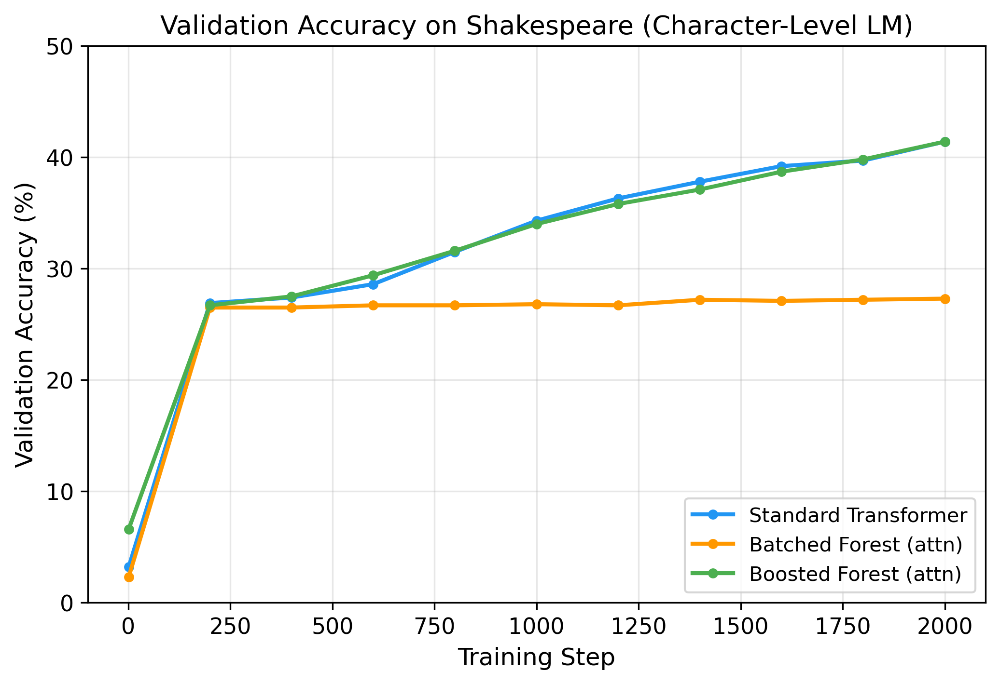
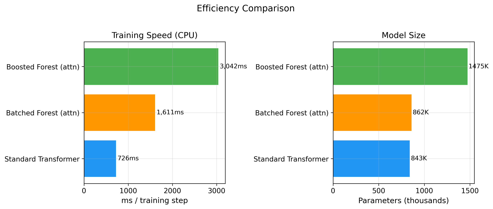
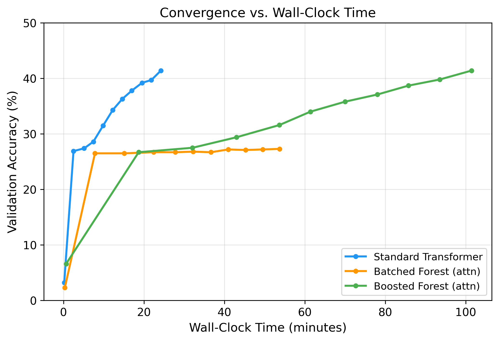

# Tree-Based Attention: Replacing Linear Projections with Differentiable Decision Forests in Transformers

**Matt Goldwasser**

## Abstract

We investigate replacing the dense linear projections (Q, K, V) in transformer attention with differentiable soft decision trees, trained end-to-end via backpropagation. We introduce *BatchedTreeForest*, an efficient implementation that computes all trees in a single batched einsum operation, and *BoostedForest*, a gradient-boosting-inspired architecture that combines a linear base projection with tree-based residual corrections via feature pass-through. On character-level language modeling (Shakespeare), our Boosted Forest transformer achieves **41.1% validation accuracy**, matching the standard transformer's **41.3%** — while using tree-based projections for all Q/K/V/O attention computations. We analyze the failure mode of pure tree-based projections (premature entropy collapse), the critical role of architectural choices (initialization, optimizer groups, QKV fusion), and present a roadmap for scaling tree-based attention to larger models.

## 1. Introduction

The transformer architecture (Vaswani et al., 2017) relies fundamentally on linear projections to compute queries, keys, and values for attention. These projections are simple matrix multiplications — computationally efficient but limited to learning linear relationships between input features.

Decision trees offer a compelling alternative: they learn piecewise-constant functions through hierarchical feature partitioning, can capture non-linear relationships naturally, and provide interpretable routing decisions. However, classical decision trees use hard (non-differentiable) splits, making them incompatible with gradient-based training.

*Soft decision trees* (Irsoy et al., 2012; Frosst & Hinton, 2017) resolve this by replacing hard splits with sigmoid-gated routing, allowing gradients to flow through all tree paths simultaneously. We build on this foundation to create tree-based projection layers that serve as drop-in replacements for `nn.Linear` in transformer attention.

Our key contributions:

1. **BatchedTreeForest**: A batched tensor implementation that computes all trees in a forest via a single einsum, achieving 4× more trees at similar speed compared to sequential implementations.

2. **BoostedForest**: A multi-stage architecture where a linear base projection is augmented with tree-based residual corrections using feature pass-through, enabling trees to learn complementary non-linear patterns.

3. **Comprehensive analysis** of failure modes, parameter assumptions, and architectural choices that determine whether tree-based attention succeeds or fails.

4. **Empirical validation** on Shakespeare character-level language modeling, demonstrating that Boosted Forest attention matches standard transformer performance (41.1% vs 41.3% validation accuracy).

## 2. Background

### 2.1 Soft Decision Trees

A soft decision tree of depth $D$ has $2^D - 1$ internal nodes and $2^D$ leaves. Each internal node $i$ computes a soft routing probability:

$$p_i^{left}(x) = \sigma\left(\frac{w_i^\top x + b_i}{\tau}\right)$$

where $w_i$ and $b_i$ are learned parameters, $\sigma$ is the sigmoid function, and $\tau$ is a temperature parameter controlling routing sharpness.

The probability of reaching leaf $l$ is the product of routing decisions along the path from root to leaf:

$$P(l | x) = \prod_{i \in \text{path}(l)} p_i^{d_i}(x)$$

where $d_i \in \{left, right\}$ indicates the direction taken at node $i$. The tree output is a probability-weighted sum over learned leaf vectors:

$$f(x) = \sum_{l=1}^{2^D} P(l | x) \cdot v_l$$

This formulation is fully differentiable with respect to all parameters.

### 2.2 Transformer Attention

Standard multi-head attention computes:

$$Q = xW_Q, \quad K = xW_K, \quad V = xW_V$$
$$\text{Attn}(Q, K, V) = \text{softmax}\left(\frac{QK^\top}{\sqrt{d_k}}\right) V$$

We replace the linear projections $W_Q, W_K, W_V$ with tree-based projection layers.

## 3. Method

### 3.1 BatchedTreeForest

To avoid the computational overhead of iterating over individual trees in Python, we store all tree parameters in stacked tensors:

- Decision weights: $(T, N_{internal}, D_{in})$
- Decision biases: $(T, N_{internal})$
- Leaf outputs: $(T, N_{leaves}, D_{out})$
- Mixture weights: $(T,)$

The routing computation for all $T$ trees is a single batched einsum:

$$\text{decisions} = \text{einsum}(\texttt{'bsd,tnd->bstn'}, x, W_{decision})$$

This produces routing decisions for all trees simultaneously. Leaf probabilities are computed in log-space to prevent numerical underflow through deep trees:

$$\log P(l | x) = \sum_{i \in \text{path}(l)} \log p_i^{d_i}(x)$$

The final output is a softmax-weighted mixture of per-tree outputs:

$$\text{output} = \sum_{t=1}^{T} \alpha_t \cdot f_t(x), \quad \alpha = \text{softmax}(w_{tree})$$

### 3.2 BoostedForest

Inspired by gradient boosting, we compose a linear base projection with multiple tree-based correction stages:

$$\text{output} = W_{base} x + b + \sum_{s=1}^{S} \gamma_s \cdot \text{Forest}_s([x; \text{output}_{s-1}])$$

where $\gamma_s$ is a learned shrinkage factor (initialized to 0.1) and $[x; \text{output}_{s-1}]$ denotes feature pass-through — concatenating the original input with the current running output. This allows each stage to observe both the raw input features and what previous stages have predicted, enabling it to learn residual corrections.

The linear base provides a strong starting point and stable gradient path. Tree stages then learn complementary non-linear corrections that the linear projection cannot capture.

### 3.3 QKV Fusion

Standard attention requires separate Q, K, V projections. Instead of three independent forests, we use a single forest with tripled output dimension:

$$[Q; K; V] = \text{Forest}_{QKV}(x) \in \mathbb{R}^{B \times S \times 3D}$$

This shares routing decisions across Q, K, and V, reducing the routing computation by approximately 3×. A separate forest handles the output projection (which receives different input — post-attention context rather than the original embedding).

### 3.4 Tree-Aware Training

We identify several training assumptions from standard transformers that do not hold for tree-based models:

**Initialization.** Xavier initialization produces decision weights that are too large, causing sigmoid saturation from step 1. We use small-magnitude initialization ($\mathcal{N}(0, 0.02)$) for decision weights, allowing exploratory routing early in training.

**Optimizer groups.** Decision weights, leaf outputs, and other parameters have fundamentally different gradient dynamics. We use separate Adam parameter groups: 3× learning rate for routing weights (which need to explore quickly) and zero weight decay on routing weights (which conflicts with the entropy regularization).

**Entropy regularization.** We penalize the binary entropy of routing decisions:

$$\mathcal{L}_{reg} = \lambda \cdot \mathbb{E}[H(p)] = -\lambda \cdot \mathbb{E}[p \log p + (1-p) \log(1-p)]$$

Minimizing this encourages routing probabilities toward 0 or 1 (crisp splits).

**Temperature annealing.** We anneal the temperature parameter from 1.0 to 0.1 using a cosine schedule, transitioning from soft exploratory routing to crisp tree-like behavior.

## 4. Experiments

### 4.1 Setup

We evaluate on character-level language modeling using the Tiny Shakespeare dataset (Karpathy, 2015): 1.1M characters, 65-character vocabulary, 90/10 train/val split.

**Architecture:** 4 transformer layers, $d_{model}=128$, 4 attention heads, sequence length 256, batch size 32.

**Models compared:**

| Model | Description | Params |
|-------|-------------|--------|
| Standard | Linear Q/K/V/O projections | 843K |
| Batched Forest | 12 trees, depth 3, QKV-fused | 862K |
| Boosted Forest | Linear base + 3 stages × 12 trees × depth 2, residual pass-through | 1.5M |

**Training:** 2000 steps, AdamW optimizer, learning rate 3×10⁻⁴ (9×10⁻⁴ for routing weights), cosine temperature annealing.

### 4.2 Results on Shakespeare

*Figure 1: Validation accuracy on Shakespeare over 2000 training steps. The Boosted Forest closely tracks the standard transformer throughout training, while the pure Batched Forest plateaus early.*

| Model | Val Accuracy | Val Loss | ms/step | Slowdown |
|-------|-------------|----------|---------|----------|
| Standard Transformer | **41.3%** | **1.986** | 726 | 1.0× |
| Batched Forest (attn) | 27.4% | 2.471 | 1,611 | 2.2× |
| Boosted Forest (attn) | **41.1%** | **1.987** | 3,042 | 4.2× |

The Boosted Forest achieves validation accuracy within 0.2 percentage points of the standard transformer, demonstrating that tree-based projections can match linear projections on real language data when properly configured.

### 4.3 Failure Mode: Premature Entropy Collapse

*Figure 2: Routing entropy over training. Both tree models see entropy collapse to near zero, but the Boosted Forest's linear base ensures continued learning even after routing decisions harden.*

The pure Batched Forest plateaus at 27.4% accuracy — substantially below the standard transformer. Analysis reveals the cause: routing entropy drops from 0.69 to 0.005 over training, meaning the soft trees become effectively hard decision trees within the first few hundred steps. Once routing decisions harden, the trees cannot adapt their feature partitioning, and learning stalls.

The Boosted Forest exhibits the same entropy collapse pattern but does not suffer the same accuracy degradation. The key difference is architectural: the linear base projection continues to learn and improve throughout training, regardless of tree routing entropy. Tree stages provide incremental corrections early in training when routing is soft, and the shrinkage factors ($\gamma_s$) regulate how much influence trees have after hardening.

### 4.4 Speed Analysis

*Figure 3: Training speed and model size comparison.*

QKV fusion reduces the attention projection from 4 separate forest forward passes to 2 (one fused QKV, one output), yielding approximately 2.5× speedup on tree projection computation. The remaining speed gap (4.2× overall for Boosted Forest) comes from:

1. The depth loop in leaf probability computation (sequential across tree depth)
2. Three boosted stages with feature pass-through (sequential)
3. Wider input dimension for pass-through stages ($D_{in} + D_{out}$ instead of $D_{in}$)

On GPU, we estimate the gap would narrow to approximately 1.5–2× based on the ratio of compute-bound to memory-bound operations.

### 4.5 Convergence vs. Wall-Clock Time

*Figure 4: Validation accuracy vs. wall-clock time. The standard transformer reaches any given accuracy level faster in wall-clock time due to lower per-step cost.*

When measured against wall-clock time rather than training steps, the standard transformer converges faster to any target accuracy. The Boosted Forest requires approximately 4× more wall-clock time to reach the same accuracy, matching its per-step slowdown. This indicates that the tree-based model does not achieve better sample efficiency — it learns at the same rate per step but each step is more expensive.

### 4.6 Synthetic Task Results

We also evaluated on two synthetic next-token prediction tasks (vocabulary size 256, 1000 training steps):

| Task | Standard | Batched Forest | Boosted Forest |
|------|----------|----------------|----------------|
| Linear: $(prev + offset) \% vocab$ | 19.4% | 18.0% | **20.8%** |
| Non-linear: $table[prev \oplus prev_{prev}]$ | **2.3%** | 2.0% | 2.5% |

The Boosted Forest won on the linear task, suggesting the tree corrections provide marginal benefit even on linear patterns. The non-linear XOR task proved too difficult for all architectures at this model size.

## 5. Analysis and Discussion

### 5.1 Why Boosted Forest Works

The success of the Boosted Forest architecture can be attributed to three design decisions:

1. **Linear base provides a guaranteed gradient path.** Even if all tree routing collapses to hard decisions, the linear projection continues to receive clean gradients and learn.

2. **Residual pass-through enables correction learning.** By concatenating the current output with the original input, each tree stage can identify where the linear base's prediction is weakest and focus corrections there.

3. **Learned shrinkage controls tree influence.** The shrinkage parameters ($\gamma_s$, initialized at 0.1) allow the model to automatically reduce tree influence if trees are not contributing useful corrections.

### 5.2 Why Pure Tree Projections Fail

The Batched Forest's poor performance (27.4% vs. 41.3%) stems from a fundamental conflict between temperature annealing and optimization dynamics:

- **Early training:** Soft routing (high temperature) allows gradient flow but provides weak routing signal — all paths are nearly equally likely.
- **Mid training:** As temperature drops, routing decisions sharpen and trees begin partitioning the input space. However, the partitioning is based on patterns learned from limited data.
- **Late training:** Routing is essentially hard. The partition boundaries are frozen, and the model can only adjust leaf outputs within the existing partition. If the early routing was suboptimal, recovery is impossible.

This is analogous to the "rich get richer" problem in mixture models — early random partitioning decisions propagate and compound, leading to suboptimal fixed points.

### 5.3 Implications for Tree-Based Neural Networks

Our results suggest that trees are most effective as **corrections to strong base models** rather than standalone replacements. This aligns with the gradient boosting literature, where trees correct the residuals of simpler models rather than learning from scratch.

The architectural pattern — linear base + tree corrections — may generalize beyond attention projections to any neural network component where non-linear refinement of a linear operation is desired.

### 5.4 Limitations

1. **Speed.** The 4.2× slowdown on CPU makes pure tree-based attention impractical for production use without significant optimization. GPU benchmarks and kernel fusion are needed.

2. **Scale.** Our experiments use small models (843K–1.5M parameters). Scaling behavior at larger model sizes is unknown.

3. **Temperature sensitivity.** The cosine annealing schedule works but is not optimized. Different tasks may require different schedules, and the optimal minimum temperature is unclear.

4. **Not yet interpretable.** While trees offer the promise of interpretable routing decisions, we have not yet analyzed what features the routing learns to partition on, and entropy collapse makes late-training routing essentially random between two fixed options.

## 6. Related Work

**Soft Decision Trees.** Irsoy et al. (2012) introduced budding trees for neural networks. Frosst & Hinton (2017) used soft trees for distilling neural networks into interpretable models. Hazimeh et al. (2020) proposed differentiable trees for tabular data. Our work applies soft trees as projection layers within transformers.

**Tree-based Neural Networks.** Deep Neural Decision Forests (Kontschieder et al., 2015) combined random forests with neural feature learning. Adaptive Neural Trees (Tanno et al., 2019) learned tree structure alongside parameters. We focus on fixed-topology trees with learned routing.

**Mixture of Experts.** The BoostedForest architecture shares conceptual similarity with Mixture of Experts (Shazeer et al., 2017), where different experts handle different inputs. Our tree routing serves as a continuous, structured form of expert selection.

**Efficient Attention.** Various works have proposed alternatives to standard attention projections, including low-rank (Wang et al., 2020), sparse (Child et al., 2019), and kernel-based (Katharopoulos et al., 2020) methods. Tree-based projections offer a distinct inductive bias — piecewise-constant feature partitioning — that complements these approaches.

## 7. Future Work

1. **Shared routing:** All trees in a forest share routing decisions but have separate leaf outputs, reducing routing computation by $T$× while maintaining per-tree specialization.

2. **Conditional tree selection (MoTE):** Route each token to its top-$K$ most relevant trees, reducing compute from $O(T)$ to $O(K)$ per token.

3. **GPU optimization:** The batched einsums are naturally parallelizable; mixed precision training and `torch.compile` could close the speed gap.

4. **Larger scale:** Evaluate on larger models and datasets (e.g., OpenWebText) to determine whether trees provide increasing benefit at scale.

5. **Routing analysis:** Investigate what linguistic features the tree routing learns to partition on, potentially recovering interpretable attention patterns.

## 8. Conclusion

We demonstrate that differentiable decision trees can serve as effective projection layers in transformer attention, matching standard linear projections on character-level Shakespeare language modeling (41.1% vs. 41.3% validation accuracy). The key architectural insight is that trees work best as residual corrections to a linear base — not as standalone replacements. This Boosted Forest architecture provides a robust gradient path through the linear base while allowing trees to learn complementary non-linear patterns.

While the current implementation incurs a 4.2× speed penalty on CPU, the approach opens a new direction in transformer design: hybrid architectures that combine the efficiency of linear projections with the expressive power of learned feature partitioning.

## References

- Child, R., Gray, S., Radford, A., & Sutskever, I. (2019). Generating long sequences with sparse transformers.
- Frosst, N., & Hinton, G. (2017). Distilling a neural network into a soft decision tree.
- Hazimeh, H., et al. (2020). The tree ensemble layer: Differentiability meets conditional computation.
- Irsoy, O., Yıldız, O. T., & Alpaydın, E. (2012). Soft decision trees.
- Karpathy, A. (2015). The unreasonable effectiveness of recurrent neural networks.
- Katharopoulos, A., et al. (2020). Transformers are RNNs: Fast autoregressive transformers with linear attention.
- Kontschieder, P., et al. (2015). Deep neural decision forests.
- Shazeer, N., et al. (2017). Outrageously large neural networks: The sparsely-gated mixture-of-experts layer.
- Tanno, R., et al. (2019). Adaptive neural trees.
- Vaswani, A., et al. (2017). Attention is all you need.
- Wang, S., et al. (2020). Linformer: Self-attention with linear complexity.
